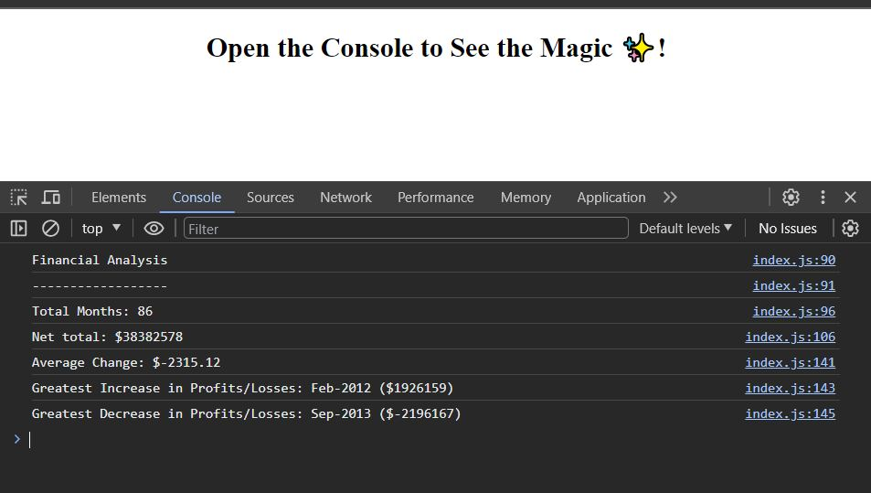

# Console-Finances

## Description

I wanted to create code for analysing the financial records of a company and to see the results via the console.

This has been achieved by:
* Writing JS code to analyse the dataset that the company provided.
* Present the findings via a collection of `console.log`'s to allow the user to see the results in the console.

 

## Installation

Please use the following link to access the website: https://e-davies.github.io/Console-Finances/

## Usage

This webpage will allow users to access the results of the analysis carried out on the company's financial dataset.  

